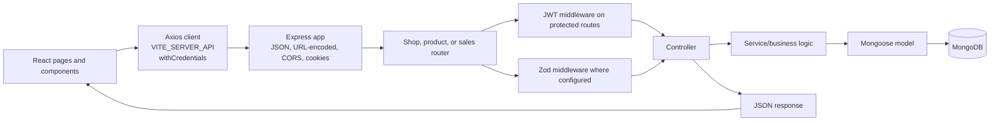

# BizTrack

BizTrack is a React and Express application for small shops to maintain a product inventory, record sales, monitor low stock, and track amounts paid and still due. Shop accounts are verified by email and authenticate with a signed JWT stored in an HTTP-only cookie.

This guide describes the implementation currently present in the repository. It is not a security audit, and it distinguishes working flows from gaps or inconsistencies visible in the source.

## Contents

- [Capabilities and current scope](#capabilities-and-current-scope)
- [Technology](#technology)
- [Architecture and request flow](#architecture-and-request-flow)
- [Repository structure](#repository-structure)
- [Frontend](#frontend)
- [Backend](#backend)
- [API reference](#api-reference)
- [Data models](#data-models)
- [Authentication and security behavior](#authentication-and-security-behavior)
- [Email and external services](#email-and-external-services)
- [Local development](#local-development)
- [Environment variables](#environment-variables)
- [Errors and troubleshooting](#errors-and-troubleshooting)
- [Testing, build, and deployment](#testing-build-and-deployment)
- [Limitations and improvement opportunities](#limitations-and-improvement-opportunities)
- [Contribution and license](#contribution-and-license)

## Capabilities and current scope

### Implemented

| Capability | User-facing flow | Supporting implementation |
|---|---|---|
| Shop accounts | Register a shop, verify its email, log in, view shop details, log out, or delete the account | `Register`, `VerifyEmail`, `Login`, and `Dashboard` pages; shop routes, controllers, services, and the shop model |
| Password recovery | Request a reset email and set a new password from its link | `ForgotPassword` and `ResetPassword` pages; token generation, hashing, expiry checks, and reset services |
| Product inventory | Add a product and browse the shop's product list | `AddProduct` and `SeeProduct` pages; product model and product routes |
| Low-stock tracking | See products at or below their configured threshold and add stock | `LowStock` page; less-stock query and stock update route |
| Sales | Create a sale for one or more products, record an initial payment, and decrement inventory | `CreateSell` page and transactional sale service |
| Sales history and receipts | Browse sales, record an additional payment, and download a PDF receipt in the browser | `SalesHistoryPage`, sales-history API, payment API, jsPDF |
| Responsive interface | Landing, account, inventory, and sales screens | React components styled with Tailwind CSS |

### Not found in the inspected implementation

The source does not provide product editing or deletion endpoints, user roles beyond an authenticated shop account, a separate customer database, pagination or server-side search, or a backend invoice/PDF endpoint. The receipt is assembled client-side from the sales history response. These items should be treated as absent rather than implied by landing-page copy.

## Technology

| Area | Technologies confirmed in source/manifests |
|---|---|
| Frontend | React 19, React DOM, React Router 7, Axios, Vite 8, Tailwind CSS 4, `@tailwindcss/vite`, jsPDF, `jspdf-autotable` |
| Backend | Node.js ES modules, Express 5, Mongoose 9 |
| Database | MongoDB accessed through Mongoose |
| Authentication | `jsonwebtoken`; JWT delivered in an HTTP-only cookie; `bcrypt` password hashing |
| Validation | Zod schemas applied by Express middleware, with Mongoose schema validation for persisted documents |
| Email | Calls to a configured Google Apps Script email endpoint using `fetch` |
| Other backend dependencies | `cors`, `cookie-parser`, `dotenv` |
| Development tools | ESLint 9 and its React Hooks/Refresh plugins; nodemon for the server's start script |
| Styling | Tailwind CSS and styles in `client/src/index.css`; the stylesheet imports Manrope from Google Fonts |

## Architecture and request flow

The frontend is a Vite single-page React application. It calls the backend through a shared Axios instance with credentials enabled. The backend registers its routers directly at the root URL; there is no `/api` prefix in the router setup.



The server middleware order is JSON parsing, URL-encoded parsing, CORS, cookie parsing, then the shop, product, and sales routers, followed by a generic error handler. Some route middleware validates requests before calling a controller. Services perform database and business operations; sale creation and account deletion use MongoDB sessions and transactions.

## Repository structure

The tree below includes relevant tracked/unignored source and manifests. Dependency folders, generated build output, caches, logs, and ignored environment files are intentionally omitted.

```text
BizTrack/
├── .gitignore
├── README.md
├── client/
│   ├── .gitignore
│   ├── package.json
│   ├── package-lock.json
│   ├── index.html
│   ├── vite.config.js
│   ├── eslint.config.js
│   ├── public/
│   │   ├── favicon.svg
│   │   └── icons.svg
│   └── src/
│       ├── main.jsx
│       ├── App.jsx
│       ├── index.css
│       ├── api/axios.js
│       ├── protectedRoute/
│       │   ├── ProtectedRoute.jsx
│       │   └── LoginRegisterRouteAccess.jsx
│       ├── pages/
│       │   ├── Home.jsx
│       │   ├── Register.jsx
│       │   ├── VerifyEmail.jsx
│       │   ├── Login.jsx
│       │   ├── ForgotPassword.jsx
│       │   ├── ResetPassword.jsx
│       │   ├── Dashboard.jsx
│       │   ├── AddProduct.jsx
│       │   ├── SeeProduct.jsx
│       │   ├── LowStock.jsx
│       │   ├── CreateSell.jsx
│       │   └── SalesHistoryPage.jsx
│       └── components/
│           ├── AddProduct/       # Product form, fields, actions, and header
│           ├── CreateSell/       # Buyer, product selection, totals, and sale form
│           ├── Layout/           # Public navigation and footer
│           ├── SeeProduct/       # Product list/table
│           ├── dashboard/        # Shop details, quick actions, logout, deletion
│           ├── home/             # Landing page hero, features, and steps
│           ├── login/            # Login form and page framing
│           ├── register/         # Registration form and shared auth inputs
│           └── salesHistory/     # Sales history, payment controls, PDF receipt
└── server/
    ├── package.json
    ├── package-lock.json
    ├── index.js
    ├── app.js
    ├── config/
    │   ├── config.js
    │   └── database.js
    ├── router/
    │   ├── shop.router.js
    │   ├── product.router.js
    │   └── sales.router.js
    ├── controller/               # HTTP request/response handlers
    ├── service/                  # Business logic and database operations
    ├── middleware/               # JWT and request validation
    ├── validation/               # Zod request schemas
    └── models/
        ├── register.models.js
        ├── products.models.js
        └── sales.models.js
```

The backend directories contain controller, service, middleware, and validation files corresponding to the route and feature names. The client package is independent of the server package; each has its own manifest and lockfile. There is no root package manifest.

## Frontend

`client/src/main.jsx` mounts the React application, and `App.jsx` defines routes with React Router:

| Browser route | Page | Access behavior |
|---|---|---|
| `/` | `Home` | Public |
| `/register`, `/login` | `Register`, `Login` | Wrapped by `LoginRegisterRouteAccess`; redirects authenticated users to `/dashboard` |
| `/verify-email` | `VerifyEmail` | Public; reads `token` from the query string and posts it to the API |
| `/forgot-password` | `ForgotPassword` | Public |
| `/reset-password` | `ResetPassword` | Public; reads `token` from the query string |
| `/dashboard` | `Dashboard` | Protected |
| `/products/create` | `AddProduct` | Protected |
| `/see-products` | `SeeProduct` | Protected |
| `/sales/create` | `CreateSell` | Protected |
| `/sales` | `SalesHistoryPage` | Protected |
| `/less-stock` | `LowStock` | Protected |

`ProtectedRoute` checks authentication by requesting `GET /me`; while waiting it shows a loading message and redirects to `/login` if the request fails. `LoginRegisterRouteAccess` performs the same check and redirects authenticated users to the dashboard. These are client-side navigation checks; the backend separately protects data routes.

The shared Axios client in `client/src/api/axios.js` uses `import.meta.env.VITE_SERVER_API` as its base URL and sets `withCredentials: true` so browser requests include the authentication cookie. Components mostly use React's local `useState` and `useEffect`; no external global state library is present.

Forms submit through Axios and display component-level loading, error, or success states. Registration and login forms serialize browser `FormData`; other features construct JSON payloads. The reset form includes independent show/hide controls for the new password and confirmation inputs.

The sales-history page builds PDF receipts in the browser with jsPDF and `jspdf-autotable`. The receipt is not produced or stored by the server.

## Backend

### Startup and configuration

`server/index.js` starts the Express app on the configured port and calls the MongoDB connection function from the listen callback. `server/config/config.js` reads environment values through dotenv and `server/config/database.js` connects Mongoose to MongoDB.

`server/app.js` configures JSON and URL-encoded request parsing, credentialed CORS for the configured frontend origin, cookie parsing, the three routers, and a generic error response. There is no global `/api` mount prefix.

### Routes and middleware

- `shop.router.js`: registration, email verification, login, current-user lookup, logout, account deletion, and password reset.
- `product.router.js`: product creation/listing, low-stock listing, and stock updates.
- `sales.router.js`: sales history and payment updates.
- `verifyJWT.js`: reads `req.cookies.token`, verifies it, and assigns the decoded `shopId` to the request.
- `shop.validate.js`, `shop.login.js`, `validate-forgot-password.js`, `validate-reset-password.js`, `product.validate.js`, `validate-sale.js`, and `due.payment.js`: invoke their corresponding Zod schemas. Routes without one of these middleware functions do not receive that validation.

Controllers format the HTTP response and call services. Most controller errors are passed to the app's final handler, which always responds with status `500` and `{ success: false, message: error.message }`. It does not use an error's `statusCode` property. Password-reset failures are an exception: invalid/expired links return `400`, and other reset failures return `500`.

### Services

- Account services register and verify accounts, authenticate logins, send reset emails, hash and reset passwords, and delete an account with its products and sales.
- Product services create/list products, find products at or below their low-stock threshold, and increment stock.
- Sale services calculate sale totals and payment status, save a sale, decrement stock, list sales, and update payments.

## API reference

All paths below are relative to the backend origin configured in `VITE_SERVER_API`; the Express routers are mounted at `/`. Request and response examples are schematic and omit real user data and credentials.

All JSON responses use `success` and generally include `message`; successful data-bearing responses use `data`. Authentication failures from `verifyJWT` return `401` with `Authentication required` or `Invalid or expired token`. Validation middleware returns `400`; some validation endpoints return the first issue in `message`, while password and forgot-password validators return an `errors` array.

| Method | Endpoint | Authentication | Request body / parameters | Purpose | Success response | Error responses |
|---|---|---|---|---|---|---|
| `POST` | `/register` | No | `{ shopName, email, phone, password, confirmPassword }`. Shop name at least 5 characters and letters/spaces only; valid email; phone exactly 10 digits; password 6–12 chars with lowercase, uppercase, special character; confirmation must match. | Create an unverified shop and send an email verification link. | `201`, `{ success, message, data: { id, shopName, email, phone, isVerified } }` | `400` validation; service/controller errors go through generic `500`. Duplicate email is not mapped to a conflict status. |
| `POST` | `/verify-email` | No | `{ token }` | Verify an email using the emailed token. | `200`, `{ success: true, message: "Email verified successfully" }` | Invalid/expired token errors are passed to the generic `500` handler; the route has no Zod middleware. |
| `POST` | `/login` | No | `{ email, password }`; email is validated and password must be nonempty. | Authenticate a verified shop and set the JWT cookie. | `200`, `{ success, message, data: { id, shopName, email, phone, isVerified } }` | Validation `400`; incorrect credentials/unverified account errors currently reach generic `500`, not `401`. |
| `GET` | `/me` | Yes | Cookie: `token` | Return the authenticated shop's public fields. | `200`, `{ success: true, message: "Authenticated", data: { shopName, email, phone, isVerified, _id } }` | `401` missing/invalid/expired JWT; other failures use generic `500`. |
| `POST` | `/logout` | No | None | Clear the authentication cookie. | `200`, `{ success: true, message: "Logout successful" }` | No route-specific errors are defined. |
| `POST` | `/forgot-password` | No | `{ email }`; must be a valid email. | For a verified matching account, store a hashed reset token and request a reset email. | `200`, `{ success: true, message: "If an account exists with this email, a password reset link has been sent." }` | Validation `400`; email-send or other service errors return `500` with a generic message. The response intentionally does not reveal whether an account exists. |
| `POST` | `/reset-password` | No | `{ token, password, confirmPassword }`; password uses the same 6–12 character composition rules and must match confirmation. | Validate the unexpired token, update the password hash, and clear the token fields. | `200`, `{ success: true, message: "Password has been reset successfully" }` | Validation `400`; invalid/expired link `400`; other reset errors `500`. |
| `DELETE` | `/delete` | Yes | Cookie: `token` | Delete the authenticated shop, its products, and its sales in a transaction; clear the cookie. | `200`, `{ success, message, data: { deletedProducts, deletedSales } }` | Missing/invalid auth `401`; service errors currently become generic `500`. |
| `POST` | `/products/create` | Yes | `{ productName, buyingPrice, sellingPrice, mrp, discount, stock, quantityType, lowStockThreshold, manufacturingDate, expiryDate }`. Prices/quantities are coerced to numbers and must be nonnegative; dates are coerced; quantity type must be one of the model's enum values. | Create a product for the authenticated shop. | `201`, `{ success, message, data: productFields }` | Auth `401`; validation `400`; other errors `500`. |
| `GET` | `/see-products` | Yes | Cookie: `token` | List products belonging to the authenticated shop. | `200`, `{ success, message, data: [...] }` | Auth `401`; see [limitations](#limitations-and-improvement-opportunities) for an error-path issue in this controller. |
| `GET` | `/less-stock` | Yes | Cookie: `token` | Return the shop's products where `stock <= lowStockThreshold`. | `200`, `{ success, message, data: [...] }` with selected product name, stock, threshold, and unit fields | Auth `401`; service errors `500`. |
| `PATCH` | `/products/:productId/stock` | Yes | Path: `productId`. Body: `{ stock }`, which is applied as an increment to existing stock. This route has no Zod validator. | Add to an existing product's stock for the authenticated shop. | `200`, `{ success, message: "Stock updated successfully", data: { id, productName, stock, quantityType, lowStockThreshold } }` | Auth `401`; missing product sets a service `404` property but the generic handler currently responds `500`; malformed/negative increments are not rejected by route-level validation. |
| `POST` | `/sales/create` | Yes | `{ buyerName, buyerPhone, buyerAddress, items: [{ productId, quantity }], paidAmount }`. At least one item; each quantity is an integer >= 1; paid amount is nonnegative. | Create a sale, calculate totals/payment status, and decrement stock within a transaction. | `201`, `{ success, message, data: { id, shopId, buyerName, buyerPhone, buyerAddress, items, totalAmount, paidAmount, dueAmount, paymentStatus, createdAt } }` | Auth `401`; validation `400`; missing products, insufficient stock, or paid amount above total currently become generic `500`. |
| `GET` | `/sales` | Yes | Cookie: `token` | Return the authenticated shop's sales, newest first. | `200`, `{ success, message, data: [...] }` including buyer details, item snapshots, amounts, payment status, and creation date | Auth `401`; service errors `500`. |
| `PATCH` | `/sales/:saleId/payment` | Yes | Path: `saleId`. Body: `{ amountReceived }`, a positive finite number. | Add a payment to a sale's remaining due amount and update its status. | `200`, `{ success, message: "Payment updated successfully", data: updatedSale }` | Auth `401`; validation `400`; missing sale, no remaining due, or amount over remaining due currently reach generic `500`. |

The backend does not define a standard `404` response for unknown paths in the inspected app setup; Express's default not-found behavior applies.

## Data models

All three Mongoose schemas enable `timestamps`, so persisted documents receive `createdAt` and `updatedAt`. No explicit foreign-key enforcement is implemented.

### Shop (`register.models.js`)

| Field | Type | Required / default | Constraints and notes |
|---|---|---|---|
| `shopName` | String | Required | Trimmed |
| `email` | String | Required | Unique; lowercased and trimmed |
| `phone` | String | Required | Trimmed |
| `hashedPassword` | String | Required | Stores a bcrypt hash |
| `isVerified` | Boolean | Required; defaults to `false` | Set true by email verification |
| `verificationToken` | String | Optional; defaults to `null` | Raw email-verification token in current implementation |
| `verificationTokenExpires` | Date | Optional; defaults to `null` | Has a MongoDB TTL index with `expireAfterSeconds: 0`; cleared after successful verification |
| `resetPasswordToken` | String | Optional; defaults to `null` | Stores SHA-256 digest of the reset token |
| `resetPasswordTokenExpires` | Date | Optional; defaults to `null` | Reset service checks this date explicitly; no TTL index is declared for it |

### Product (`products.models.js`)

| Field | Type | Required / default | Constraints and notes |
|---|---|---|---|
| `productName` | String | Required | Trimmed |
| `buyingPrice`, `sellingPrice`, `mrp`, `discount` | Number | Required | No additional Mongoose minimum is declared |
| `stock`, `lowStockThreshold` | Number | Required | No additional Mongoose minimum is declared |
| `quantityType` | String | Required | Enum: `pieces`, `kg`, `g`, `liter`, `packet`, `box`, `bottle` |
| `manufacturingDate`, `expiryDate` | Date | Required | |
| `shopId` | ObjectId | Required | Indexed; schema reference is `"Shop"` |

### Sale (`sales.models.js`)

| Field | Type | Required / default | Constraints and notes |
|---|---|---|---|
| `shopId` | ObjectId | Required | Indexed; schema reference is `"Shop"` |
| `buyerName`, `buyerPhone`, `buyerAddress` | String | Required | Trimmed |
| `items` | Embedded item array | Required | Must contain at least one item |
| `totalAmount`, `paidAmount`, `dueAmount` | Number | Required | Each has a minimum of zero |
| `paymentStatus` | String | Required | Enum: `due`, `partial`, `paid` |

Each embedded sale item stores `productId` (required ObjectId, reference `"Product"`), `productNameSnapshot` (required string), `quantity` (required number with minimum 1), `unitPriceSnapshot` (required number, minimum 0), and `lineTotal` (required number, minimum 0). The sale-request Zod schema separately requires item quantities to be integers. Embedded sale items do not have their own `_id`.

The account model is registered under the Mongoose model name `shopRegister`, while the `shopId` fields in Product and Sale declare a `"Shop"` reference. Current services explicitly query by `shopId`, but the reference-name mismatch should be reviewed before relying on Mongoose population.

## Authentication and security behavior

- Registration validates the fields with Zod, hashes the password with bcrypt using 12 rounds, stores an email-verification token and a 15-minute expiry, and attempts to send a verification email.
- The verification token is stored as generated; the verification service checks the token and expiry, marks the account verified, then clears both verification fields.
- Login rejects unknown accounts, unverified accounts, and mismatched passwords. On success it signs a JWT containing `shopId` using configured signing/expiry values and sends it as the `token` cookie.
- The login cookie is `httpOnly`, `sameSite: "lax"`, has a one-day `maxAge`, and sets `secure` when `NODE_ENV` is `"production"`.
- Protected routes validate the cookie JWT in `verifyJWT`; the middleware assigns the decoded ID to `req.shopId`. Product and sales services scope their data lookups by that ID.
- Logout clears the cookie. Account deletion removes the shop and its products/sales in a database transaction and then clears the cookie.
- Password recovery generates a random token, stores only its SHA-256 digest with a 15-minute expiration, and sends the raw token only in the reset URL. Reset hashes the supplied token for lookup, checks that the account is verified and expiry is in the future, bcrypt-hashes the new password, and clears reset-token fields.

These are descriptions of the observed implementation, not an assessment that it is secure. The raw verification token, cookie behavior on account deletion, generic error status handling, missing stock-update validation, and referenced-model mismatch are areas to review. CORS is configured for one configured frontend origin and credentialed requests.

## Email and external services

Registration, email verification, and password recovery call the configured email URL with a JSON body containing recipient, subject, and HTML. The source labels this endpoint as a Google Apps Script email service. The implementation of that remote service is not part of the inspected repository, so its delivery behavior and required payload contract cannot be verified here.

Registration attempts the email `fetch` after creating the account; its catch block logs a generic message and continues returning the registration success result. The verification service marks the account verified before its confirmation-email request. Password recovery saves the reset-token digest and expiry before sending the email; a non-OK HTTP response causes the request to return an error even though the token fields have already been saved.

No file-upload/storage integration or other external API client was found. The PDF receipt is generated in the browser.

## Local development

### Prerequisites

- Node.js and npm versions compatible with the versions in the client and server lockfiles. The manifests do not declare an explicit Node.js engine range.
- A MongoDB deployment accessible through `DB_URL`. Sale creation and account deletion use MongoDB transactions, so the selected MongoDB deployment must support transactions.
- A configured email endpoint if testing verification and password recovery end to end.

### Install dependencies

Run each package manager command from its package directory:

```powershell
Set-Location client
npm install

Set-Location ..\server
npm install
```

### Configure runtime values

Supply the environment variables listed in [Environment variables](#environment-variables) through your local shell or deployment environment. Do not commit secrets. `dotenv` is initialized by the server configuration module. The frontend build reads `VITE_SERVER_API` through Vite; configure it to the backend origin.

The backend's credentialed CORS origin must match the frontend origin configured with `FRONTEND_URL`. The frontend API base URL should point to the backend root because the routes are not prefixed with `/api`.

### Run

In one terminal:

```powershell
Set-Location server
npm start
```

In another terminal:

```powershell
Set-Location client
npm run dev
```

The server's `start` script runs `nodemon index.js`. The Vite client provides the browser app; requests use `VITE_SERVER_API`.

## Environment variables

Variable names below are taken from permitted source code only. Values are intentionally represented by placeholders.

| Variable | Purpose | Required | Example / placeholder |
|---|---|---|---|
| `VITE_SERVER_API` | Frontend Axios backend base URL | Yes for API calls | `<backend-origin>` |
| `PORT` | Express listen port | Yes for configured startup | `<port>` |
| `DB_URL` | Mongoose MongoDB connection URI | Yes | `<mongodb-connection-uri>` |
| `FRONTEND_URL` | CORS allowed origin and base for verification/reset links | Yes | `<frontend-origin>` |
| `GOOGLE_SCRIPT_EMAIL_SEND` | Email-send endpoint used by server services | Needed for email delivery | `<email-service-url>` |
| `JWT_SECRET_KEY` | JWT signing and verification secret | Yes for login/protected routes | `<random-secret>` |
| `JWT_EXPIRES_IN` | JWT expiry accepted by `jsonwebtoken` | Yes for login | `<duration>` |
| `NODE_ENV` | Controls whether auth cookies use the `secure` flag in login/logout/account deletion handlers | Set to `production` for production cookie behavior | `production` |

No ignored environment file or secret value was opened or included in this documentation.

## Errors and troubleshooting

| Symptom | What the implementation indicates | Checks |
|---|---|---|
| Server cannot connect to MongoDB | `database.js` calls `mongoose.connect(DB_URL)` | Check that `DB_URL` is set and that MongoDB is reachable; use a deployment that supports transactions for sale/account deletion. |
| Browser API requests fail or preflight is rejected | Axios requires `VITE_SERVER_API`; Express CORS allows the configured `FRONTEND_URL` with credentials | Check the backend origin, frontend origin, and credentialed CORS configuration. |
| Protected page redirects to login | The route guard treats any failed `GET /me` as unauthenticated | Check that login succeeded, cookies are enabled, requests include credentials, and the JWT has not expired. |
| Login reports a server error for invalid credentials | Controller errors flow through a global handler that responds with `500` | Check account email/verification/password; the current API does not map these errors to `401`. |
| Verification link is invalid or expired | Verification token must match and its stored expiry must be in the future; it is valid for 15 minutes | Request a fresh registration verification link if available; verify that the emailed link reaches the configured frontend. |
| Reset link is invalid or expired | Reset endpoint hashes the presented token and queries the stored digest plus future expiry; link lifetime is 15 minutes | Request a new reset email and use the newest link promptly. The link token is distinct from the digest stored in MongoDB. |
| No reset fields appear in the account document | Current model defines `resetPasswordToken` and `resetPasswordTokenExpires`; the service only sets them for a matching verified email | Confirm the request used the correct normalized email and account is verified. If the fields still do not persist, inspect the running server's loaded model/version and the target database; those runtime details are not available from source inspection. |
| Verification/reset message is returned but email does not arrive | The remote email integration is outside this repository; registration does not check the HTTP response status, while reset-password does | Check the configured email endpoint and its delivery logs. Do not infer successful delivery from the registration success response alone. |
| Validation request rejected | Zod middleware returns HTTP `400` for invalid schema data | Read the response `message` or `errors` payload and compare the body with the API reference. |
| Product list request fails while authenticated | Product controller error path currently has an undeclared `next` reference | Inspect server logs; see the related limitation below. |

## Testing, build, and deployment

- Frontend production build: `npm run build` from `client/`.
- Frontend lint: `npm run lint` from `client/`.
- Frontend local development: `npm run dev` from `client/`.
- Backend start: `npm start` from `server/`.
- The server's `npm test` script is a placeholder that prints an error and exits unsuccessfully. No automated test files or test runner were found in the permitted project inventory.
- No deployment manifest, CI workflow, or production deployment script was found. Deployment instructions beyond setting the documented runtime configuration would be speculative.


The following are confirmed from the current source and are not silently corrected here:

1. **Error status codes:** the global Express error handler always emits `500` and ignores service `statusCode` values. This means expected cases such as bad credentials, missing resources, and business-rule rejections are not consistently reported with client-error statuses.
2. **Product-list error path:** `see.allProducts.controller.js` catches failures and calls `next(error)` without declaring `next` in its parameters, so a failure can trigger a reference error instead of reaching the normal handler.
3. **Stock increment input:** `PATCH /products/:productId/stock` has no validation middleware. Its `stock` body value is applied using MongoDB `$inc`, so it is an increment rather than replacement with an absolute stock value.
4. **Email delivery reporting:** registration catches email errors and still returns its success response; the email verification service also changes the account's verified state before attempting its confirmation message.
5. **TTL semantics:** MongoDB's TTL index is on the shop document's `verificationTokenExpires` field. Unverified registrations may be deleted after the 15-minute verification expiry; successful verification clears that date. Confirm this lifecycle is intended before relying on that index.
6. **Reference name mismatch:** Product and Sale schema references use `"Shop"`, while the account model is registered as `"shopRegister"`. Services currently query shop ownership explicitly and do not depend on `populate`.
7. **Data lifecycle/API scope:** product update/delete, pagination, server-side product search, and a separate customer model/API are absent. Account deletion handles shop, products, and sales.
8. **Test/deployment coverage:** no automated tests or deployment automation are present in the inspected repository; backend npm test is intentionally nonfunctional placeholder code.

Recommendations: add tests for token lifecycle, validation, ownership boundaries, transactional stock changes, and payment updates; centralize error-to-status mapping; validate stock increments; review the TTL/index policy and Mongoose references; and make email-send failures observable without leaking account-existence information.

## Contribution and license

No repository-level contribution guide or license file was found. The server package manifest includes `ISC` as package metadata, but that alone does not establish a repository-wide license. Follow the maintainers' guidance before contributing or redistributing the project.
